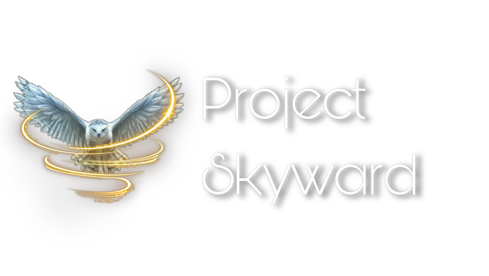

# Project Skyward


## 🌟 Our Mission
Project Skyward empowers newly-arrived refugee youth in Indianapolis by providing culturally responsive education, bilingual programs, and community-driven support. We are dedicated to helping these young learners thrive academically and socially, fostering a sense of belonging, resilience, and success as they navigate their life in America.

## 🪠 How the Website Was Built

### Framework
The website is built using **Next.js**, a React-based framework that provides server-side rendering (SSR) and static site generation (SSG) for optimal performance and scalability.

### Features
- **Fully Responsive Design**: The site is mobile-friendly and accessible on all devices.
- **Dynamic Routing**: Built using the App Router for clean and scalable navigation.
- **API Integration**: Securely integrates with Stripe for handling donations via payment intents.
- **Environment Variables**: Uses environment variables for managing sensitive keys like Stripe's API keys.
- **Tailwind CSS**: Styled with Tailwind CSS for fast and efficient custom design.
- **Custom Domain**: Deployed on Vercel and accessible via [projectskyward.org](https://projectskyward.org).

### Pages
1. **Home Page**:
   - Overview of the mission, services, and impact.
   - Call to action to get involved.
2. **About Page**:
   - Details about the organization, including refugee statistics and the importance of equitable education.
3. **Services Page**:
   - Explanation of services offered: bilingual education, academic support, community integration, and culturally responsive teaching.
4. **Donate Page**:
   - Integration with Stripe for secure donation processing.
5. **Take Action Page**:
   - Volunteer form, donation options, and social sharing tools.

### Deployment
The website is hosted on [Vercel](https://vercel.com/), enabling fast, globally distributed builds with custom domain integration.

## 💳 Donate
Your donations enable us to provide essential resources, education, and support to refugee youth. Donations are securely processed via Stripe.

Visit our [Donate Page](https://projectskyward.org/donate) to contribute to our mission.

## 🖇️ Get Involved
Want to make a difference? Visit our [Take Action Page](https://projectskyward.org/take-action) to:
- Volunteer via an embedded Google Form.
- Spread the word by sharing our mission on social media.
- Donate to support our programs.

## 🧑‍💻 Development Details

### Prerequisites
- Node.js >= 16
- npm >= 8
- Stripe account for donation processing

### Running Locally
1. Clone the repository:
   ```bash
   git clone https://github.com/amirani18/projectskyward.git
   cd projectskyward
   ```
2. Install dependencies:
   ```bash
   npm install
   ```
3. Set up environment variables:
   - Create a `.env.local` file in the root directory.
   - Add the following variables:
     ```env
     NEXT_PUBLIC_STRIPE_PUBLISHABLE_KEY=your-publishable-key
     STRIPE_SECRET_KEY=your-secret-key
     ```
4. Start the development server:
   ```bash
   npm run dev
   ```
5. Visit `http://localhost:3000` to view the app.

### Building and Deploying
1. Build the production version:
   ```bash
   npm run build
   ```
2. Start the production server locally:
   ```bash
   npm run start
   ```
3. Deploy to Vercel by pushing to the `main` branch or manually triggering a deployment from the Vercel dashboard.

## 🔧 Key Technologies
- **Next.js**: Framework for React-based web applications.
- **Stripe**: Secure payment processing for donations.
- **Tailwind CSS**: Utility-first CSS framework for styling.
- **Vercel**: Hosting platform for serverless deployment and scalability.
- **Google Forms**: Embedded form for volunteer signups.

## 👥 Contributors
- [Me :)](https://github.com/amirani18)

## 🔖 License
This project is licensed under the [GPL-3.0 License](LICENSE).

## 📧 Contact
For inquiries, please email us at: [projectskyward2025@gmail.com](mailto:projectskyward2025@gmail.com).
